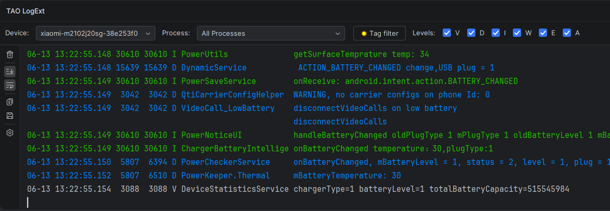
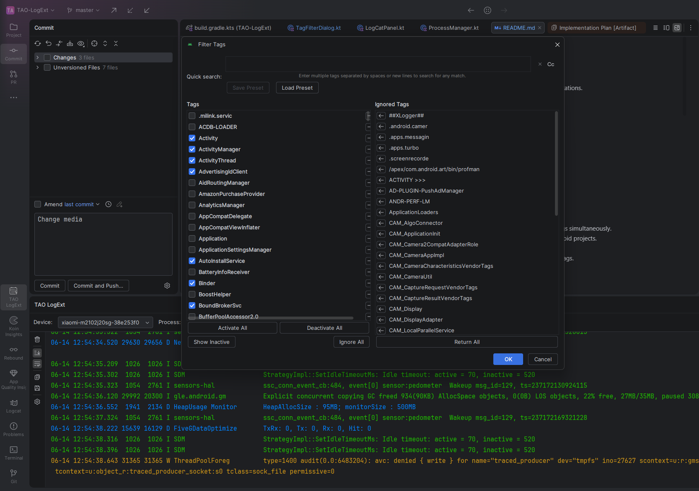
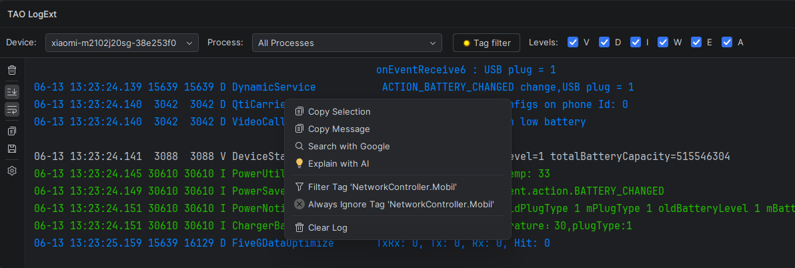
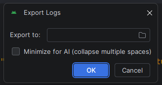
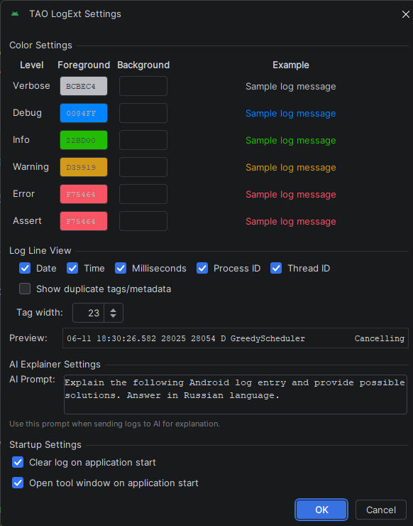

# TAO LogExt - Android LogCat Viewer

**TAO LogExt** is a highly customizable Android LogCat viewer plugin for Android Studio. It provides flexible filtering, performance optimizations.
 If your logs are overloaded with unnecessary details, then this plugin is exactly what you need.

## Key Features

### 1. Tag Management
The plugin features a two-column filtering system designed to manage large numbers of tags efficiently.

*   **Multi-tag Search**: Enter multiple tag names separated by spaces or new lines in the search area to filter the list for any matching tags simultaneously.
*   **Global Blacklist (Ignored Tags)**: Move persistent or noisy system tags to a global blacklist that remains active across different Android projects.
*   **Inactive Toggle**: Filter the tag list to show only currently hidden tags, allowing for quick re-enabling.
*   **Activity Indicator**: A lamp icon on the toolbar indicates when a project filter is active, helping to avoid missing logs due to hidden tags.
*   **Tags Preset**: Save/load tags presets.

### 2. Context Actions and AI Integration
Access essential actions directly from the log stream via the context menu.

*   **Explain with AI**: Send selected log entries directly to the **Gemini AI Agent** (Studio Bot) inside Android Studio for analysis.
*   **Copy Message**: Copy only the message text, automatically removing metadata such as dates, PIDs, and tags.
*   **Search with Google**: Perform a web search for error codes or exception messages in one click.
*   **Log Export (AI Optimized)**: Save filtered logs to a file. Includes an option to minimize log data, reducing token consumption when using external AI models for analysis.
*   **Quick Filter/Ignore**: Hide a tag from the current project or add it to the global blacklist using the right-click menu.

### 3. Workflow Automation
*   **Auto-Focus**: Automatically brings the tool window to the front when an application starts.
*   **Process Persistence**: Automatically reconnects to the selected process after app restarts or device reconnections.
*   **Source Code Navigation**: Detects `FileName.kt:Line` patterns and provides clickable links to the corresponding source code.

### 4. Visibility and Performance
*   **Custom Coloring**: Foreground and background colors can be set for each log level (Verbose, Debug, Info, Warning, Error, Assert).
*   **High-Speed Buffering**: Uses a thread-safe buffer to batch-update the UI every 100ms, maintaining IDE responsiveness during heavy logging.
*   **Customizable History**: Set the maximum number of log lines to keep in memory (default is 100,000 lines).
*   **Metadata Cleanup**: Option to replace duplicate metadata (Date, Time, PID, Tag) in consecutive lines with whitespace for better readability.

---

## Configuration

Customization options are available through the settings menu.

*   **AI Explainer Settings**: Define a custom prompt for Gemini (e.g., set the target language for explanations).
*   **Log Line View**: Toggle visibility for Date, Time, Milliseconds, PID, and TID.
*   **Tag Width**: Set a fixed column width for tags to keep messages aligned.
*   **Startup Settings**: Configure "Clear on start" and "Auto-open ToolWindow" behaviors.

---

## Installation

### From Release File
1.  Download the latest `LogCat-x.x.x.zip` from the [Releases](https://github.com/lordtao/LogCat/releases) page.
2.  In Android Studio, navigate to **Settings (Preferences) -> Plugins**.
3.  Click the gear icon ⚙️ and select **Install Plugin from Disk...**.
4.  Select the downloaded ZIP file and restart the IDE.

### From Plugin Marketplace (In Development)
1.  Open **Settings (Preferences) -> Plugins**.
2.  Search for **TAO LogExt**.
3.  Select **Install** and restart Android Studio.

## Usage
Access the tool window through **View -> Tool Windows -> TAO LogExt** or find the icon in the bottom/side tool window bar.
